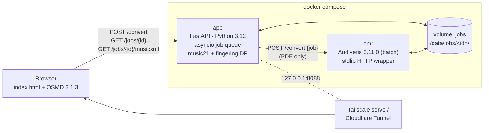

# cellistica

**Sheet music → solfège and cello fingering, self-hosted.**

Upload a PDF (or MusicXML / .mxl / MIDI) of a cello part. Cellistica runs optical
music recognition with [Audiveris](https://github.com/Audiveris/audiveris), then
renders the score in your browser with [OpenSheetMusicDisplay](https://opensheetmusicdisplay.org/)
in one of two reading views:

- **Solfège**: fixed-do Italian names (Do Re Mi Fa Sol La Si) under each note, spelled as written (G♯ → Sol♯, A♭ → La♭), or
- **Fingering**: finger number (0 = open string, 1–4) above the note, the string as a MusicXML `<string>` (drawn as I–IV) plus its letter under the note, and the position as a small text marking wherever it changes.

Both views are downloadable as annotated MusicXML. Fingerings come from a
dynamic-programming (Viterbi) search over the whole phrase rather than note by
note, so the app stays in one position instead of hopping back and forth.

> Status: personal tool, works end to end. OMR quality depends heavily on the input
> PDF (see [Known limitations](#known-limitations)). The fingering is a rule-based
> default, not a teacher's edition.

## Architecture



- **app** saves the upload into `/data/jobs/<id>/`, queues the job, and returns its id straight away. A single in-process worker handles jobs in order: for PDFs it calls **omr**, then music21 picks the part and writes both annotated MusicXML files, which are cached.
- **omr** is Audiveris behind an ~80-line stdlib HTTP wrapper that runs `Audiveris -batch -export -output /data/jobs/<id>/omr -- /data/jobs/<id>/input.pdf` and replies when it finishes. It is only reachable on the compose network. It is a tiny HTTP service rather than a subprocess because the app can't exec into another container without mounting the Docker socket, which is root-equivalent. The shared volume carries the files; the HTTP call only says "go" and "done".
- Both containers run as uid 10001 with all capabilities dropped. The app's root filesystem is read-only.

## Run

Requires Docker with Compose v2, on x86-64 Linux (the Audiveris package is amd64), with about 10 GB of RAM free for OMR.

```bash
git clone https://github.com/aminghuf/cellistica.git
cd cellistica
docker compose up -d --build        # first build downloads Audiveris (~80 MB)
open http://127.0.0.1:8088          # or curl it
docker compose logs -f app omr      # watch
docker compose down                 # stop (add -v to also drop the jobs volume)
```

API:

```bash
curl -F file=@part.pdf http://127.0.0.1:8088/convert           # -> {"id": "...", "status": "queued"}
curl http://127.0.0.1:8088/jobs/<id>                            # status, parts, OMR progress, errors
curl "http://127.0.0.1:8088/jobs/<id>/musicxml?mode=solfege"    # or mode=fingering
curl "http://127.0.0.1:8088/jobs/<id>/musicxml?mode=fingering&part=1&download=1" -OJ
```

`part` overrides the automatic choice. It takes a 0-based index or a part-name substring (`part=violoncello`). By default the app uses the first part named or identified as a cello, otherwise the part with the lowest median pitch.

Limits: 30 MB per upload (`MAX_UPLOAD_MB`); `.pdf .musicxml .xml .mxl .mid .midi`, checked by extension and magic bytes. Jobs are kept for 24 h (`JOB_TTL_HOURS`) and wiped when the app restarts. Only 127.0.0.1:8088 is published.

To expose it on your tailnet (not run automatically):

```bash
sudo tailscale serve --bg --https=443 http://127.0.0.1:8088
```

## Tests

```bash
docker compose exec app python -m pytest -q
# regenerate the music21-made fixtures (writes into app/tests/fixtures):
docker compose run --rm -v "$PWD/app:/srv" --user "$(id -u)" app python -m tests.make_fixtures
```

The tests cover the solfège mapping, bass → tenor → treble clef changes, the fingering DP (C-major scale over two octaves from C2 in 1st position with open strings, a passage that stays in 3rd position, double stops on separate strings, `?` above the neck), MusicXML output, and the HTTP API.

## How the fingering is chosen

`app/cello/positions.py` holds the data:

| position | 1st finger above the open string |
|---|---|
| half | +1 semitone |
| 1st | +2 |
| 2nd | +3 |
| 3rd | +5 |
| 4th | +7 |

In a closed hand, fingers 1–4 cover a minor third (offset +0…+3). The **back** extension moves the 1st finger down a semitone, and the **fwd** extension puts a whole step between 1 and 2. Open strings are C2 G2 D3 A3. To widen the search (for example to add an "upper 2nd" at +4), add a row to `POSITIONS`.

`app/cello/fingering.py` runs a Viterbi search over the whole part. Each note (or double stop) gets every state *(string, position, finger)* that produces it. An open string is listed once per position, because playing it doesn't move the hand. Double-stop states must use different strings and share one hand position. The search then minimises total cost:

- **Node costs**: open string vs stopped note, extension penalties, and a small per-position bias.
- **Transition costs**: position shifts (base + per-semitone distance, cheaper while an open string rings or across a rest), string crossings, and a large "impossible stretch" cost for double stops the hand can't hold.

Notes beyond 4th position (above G♯4) or below C2 get `?`, with no invented thumb-position fingerings. Rests are skipped, and they make the next shift cheaper. A tied continuation gets no new marking.

### Tuning the weights

Edit `app/fingering.toml`. It's bind-mounted read-only into the container and read for every new annotation:

```toml
[note]
open_string = 0.0      # raise to prefer 4th finger over open strings
fingered = 1.0
extension_back = 1.5
extension_fwd = 1.5
[shift]
base = 2.0             # raise to shift less, lower to stay in low positions more
per_semitone = 0.5
after_open_factor = 0.5
after_rest_factor = 0.3
[crossing]
per_string = 0.3
[chord]
impossible_stretch = 50.0
```

Annotated files are cached per job, so upload again, or run `docker compose restart app` (which also clears jobs), to see new weights take effect. The test `test_weights_change_the_result` shows the effect of raising `open_string`.

## Known limitations

- **OMR accuracy.** Audiveris does well on clean, engraved, digital-born PDFs. Phone photos, skewed or low-resolution scans (under ~300 dpi), handwritten parts, and dense multi-voice passages produce wrong or missing notes, rhythms, clefs and accidentals. Everything downstream inherits those errors: a missed tenor clef shifts every note that follows. For anything important, correct the `.mxl` (for example in MuseScore) and upload the MusicXML instead.
- **Multi-movement PDFs**: when Audiveris splits movements into several `.mxl` files, only the first one is shown (the job's `messages` says so).
- **Rule-based fingering, not a teacher's.** The model knows positions, extensions, open strings, shifts and string crossings. It doesn't know about phrasing, bowing, tone colour (for example staying on the D string for a melody), expressive slides, the length of held notes, tempo, or where a shift can hide inside a slur. It never uses thumb position. Treat its output as a sensible default to pencil over, not a performance edition.
- Double stops in two different voices are merged only when they start together. Grace notes are fingered like ordinary notes.
- MIDI input has no spelling information, so solfège follows music21's guess (often sharps).
- Jobs live in memory, so restarting the app forgets them. Only one OMR runs at a time, and a multi-page PDF can take several minutes.
- Audiveris' launcher hard-codes `-Xmx8G`, so the `omr` service has `mem_limit: 10g`. On a smaller host, lower it and expect out-of-memory failures on big scores.

## Layout

```
docker-compose.yml
omr/Dockerfile            ubuntu:noble-20260911 + Audiveris 5.11.0 .deb (sha256-pinned)
omr/omr_server.py         internal HTTP wrapper
app/Dockerfile            python:3.12.14-slim-trixie
app/requirements*.txt     pinned
app/fingering.toml        cost weights
app/cello/positions.py    strings, position table, hand shapes
app/cello/fingering.py    Viterbi search
app/cello/solfege.py      fixed-do names
app/cello/score.py        music21: part choice, events, MusicXML annotation
app/cello/jobs.py         in-process queue + OMR client
app/cello/main.py         FastAPI routes, upload limits
app/static/index.html     OSMD viewer (light/dark, mobile)
app/tests/                pytest + music21-generated fixtures
```

### Audiveris packaging notes

The official `ubuntu24.04` .deb needs two workarounds in a minimal container, both in `omr/Dockerfile`:

1. Its `postinst` registers a desktop menu entry with `xdg-desktop-menu`, which exits 3 when there are no XDG menu directories. The Dockerfile pre-creates them.
2. Even with `-batch`, startup calls into GTK3 through JNA (a HiDPI probe), but `libgtk-3` isn't a declared dependency. The Dockerfile installs `libgtk-3-0t64`.
